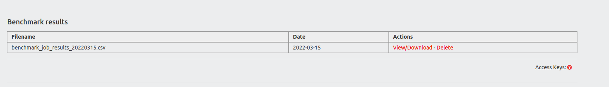

# benchmarktools

An APIv3 tool that run synthetic benchmarks using various CiviCRM and non-CiviCRM components so that it can simulate a heavy workload and introduce stress-test on to the server that it's being used. The output of the benchmark results displays in the console and to comma delimited CSV file(s).

While the benchmarks are far from perfect, we can still use the extension as a reference tool.

Imagine the following scenario:

You have a CiviCRM instance located on server A with vendor A and want to check the performance on a new server B from vendor B.
The idea with this scenario is to have 2 identical sites (server A & server B) and execute the same benchmarks on **both** servers A & B.

This way, you will be able to compare the results and judge if you need to improve further the performance of server B or not.

For each run of the benchmark, a CSV file will be generated under the folder `ConfigAndLog` with the following format:
`benchmark_job_results_<Ymd>.csv`

The CSV files are accessible under the menu structure "Administer" > "Administration Console" > "Benchmark results" where you can download them (or delete them)



Note: Due to its nature, it's preferable to execute it via console, to avoid any potential PHP timeouts through the UI.

Please feel free to fork it, add MRs or add more tests that you might find useful.

The extension is licensed under [AGPL-3.0](LICENSE.txt).

## Requirements

* PHP v7.2+
* CiviCRM 5.35+

## Installation (CLI, Git)

Sysadmins and developers may clone the [Git](https://en.wikipedia.org/wiki/Git) repo for this extension and
install it with the command-line tool [cv](https://github.com/civicrm/cv).

```bash
git clone https://git.ixiam.com/dev/civicrm/benchmarktools
cv en benchmarktools
```

## Usage

* `drush cvapi benchmarktools.run`

If you want to view the output on screen (assuming you're executing it via the console):

* `drush cvapi benchmarktools.run show_output=1`

If you want to exclude a test, add the variable `exclude` and type in the machine-name, like this:

* `drush cvapi benchmarktools.run show_output=1 exclude=smartgroups`
* `drush cvapi benchmarktools.run show_output=1 exclude=smartgroups,synopsis,mysql, report_contact,report_contribution`

Currently these are the tests that will be executed (in this order) :

| Machine-name        | Benchmark description                                 |
| ------------------- | ----------------------------------------------------- |
| report_contact      | Contact Summary Report                                |
| report_contribution | Contribution Summary Report                           |
| synopsis            | Synopsis calculation                                  |
| smartgroups         | Smartgroup cache deletion and recreation              |
| mysql               | 1K MYSQL INSERT statements into single statements     |
| mysql               | 1K MYSQL INSERT statements into one batch/statement   |
| mysql               | 10K MYSQL INSERT statements into single statements    |
| mysql               | 10K MYSQL INSERT statements into one batch/statement  |
| mysql               | 100K MYSQL INSERT statements into single statements   |
| mysql               | 100K MYSQL INSERT statements into one batch/statement |
| mysql               | 100 MYSQL random reads on 500K records                |
| mysql               | 1K MYSQL random read on 500K records                  |

### Notes

Out of the many benchmarks described above, some are CiviCRM related while some others do not actually need a CiviCRM system with contact data, they test the performance of some components.
For example, smartgroup cache deletion and recreation relies heavily on your existing CiviCRM configuration and if you don't use smartgroups, there's no actual added value to run this benchmark.

On the other hand, all MySQL tests performed will not need any CiviCRM environment with actual user data, this extension will create a table on its own,  generate its own data for the benchmarking purposes and then drop the table, once the benchmark is being completed.

It is safe to assume that those specific tests can be executed as individual server tests.

## Support and Maintenance

This extension is supported and maintained by

[](https://www.ixiam.com)